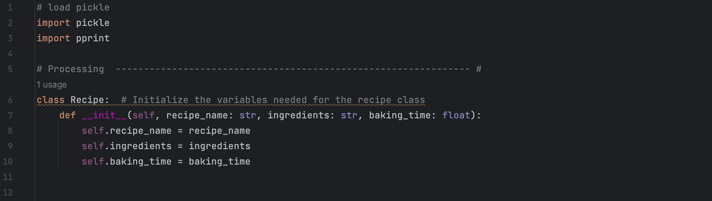

Bailey Marshall
May 30, 2023
IT FDN 110 A
Assignment 7
https://github.com/bmarshall14/IntroToProg-Python

<b> Assignment 7: Utilizing pickles and exceptions </b>
Overview: In past assignments, we have been reading, writing, and appending text files in order to save and utilize user submitted data. Text files are convenient for this because they are easy to use and compatible across platforms. However, when working with more complex information, like lists and dictionaries, it can be difficult. To better handle this complex data, python offers a program called pickle, which allows users to store complex data in a file using a single line of code. 

Exceptions on the other hand are tools which provide failsafes to ensure users are inputting the correct information in the correct format. Exceptions are quite helpful…

To practice using pickles and exceptions, I created a script called Baking with Pickles. In this script, I get input data from the user about recipes, ingredients, and the required baking time. From there, I pickle the user data for storage and save the data in a txt.file so the user can easily see the data they have submitted.

Creating the script: The first thing to do when pickling data is to import the pickle program using the import pickle command. By loading in this program, it allows you to pick and store complex data in a binary file. Once loaded, it was time to start writing the processing functions. To begin, I initialize the variables present in my Recipe Class.

From there, it was time to define my pickling functions. To pickle the data retrieved from the user, I defined a function, baking_with_pickles. In this function, I wrote the data obtained from the Recipe Class and wrote it to a new binary file called recipe.db (defined in the main body of the script). In the case that there is no file to save, the user will receive an error and inform them that their data was not saved. A second pickle-related function was defined in order to allow the user to see the data that was saved. While pickling is useful for storing data, it is not useful for users. To make this program more user-friendly, I defined pickle_to_text, a function which dumps the pickle database into a new file. 

After defining the necessary processing functions, I wrote the input/output section of the script. In this program, there is one user input function and one user output function required. The needed input function allows the user to input data associated with the recipe they’d like to store. In this function, I built in an exception to ensure the user inputs the baking time as a number value, rather than a string. This is helpful to ensure the correct information is collected and stored from the user. The output function enables the program to display the user input information back to the user. 

Once all functions were defined, I called each function in the main body of the script and defined the necessary variables and/or filenames required for each function. To ensure the main body of the script was working correctly, I tested this program in both PyCharm and Terminal. After running the code, two files were created in my working directory, recipe.db and recipe.txt. 
