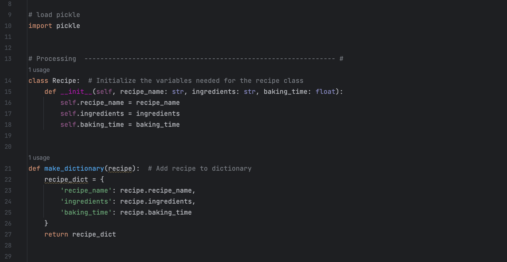
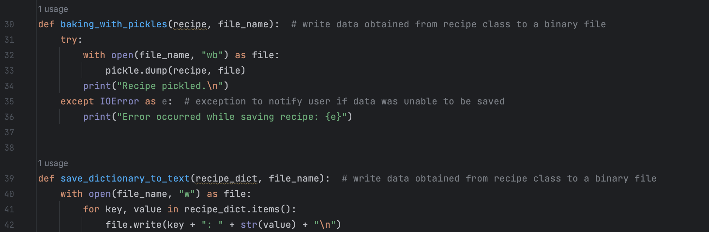
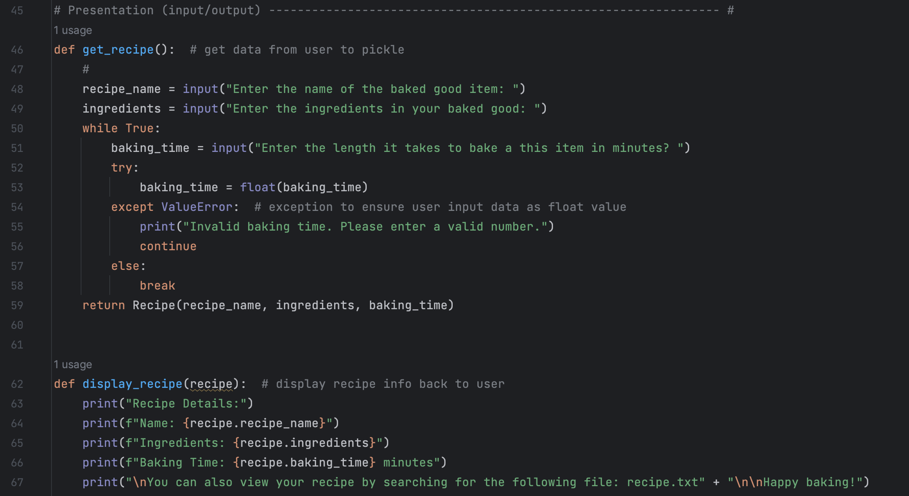
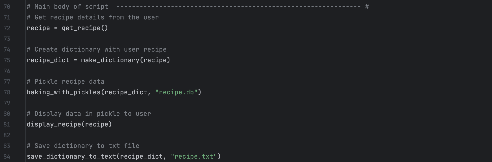
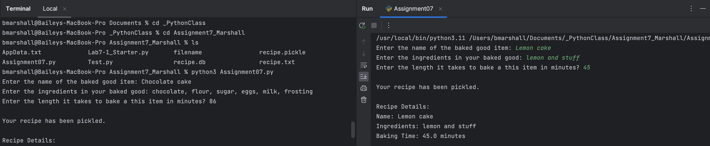

Bailey Marshall

May 30, 2023

IT FDN 110 A

Assignment 7

https://github.com/bmarshall14/IntroToProg-Python-Mod07

                                              Assignment 7: Utilizing pickles and exceptions

Overview: In past assignments, we have been reading, writing, and appending text files in order to save and utilize user submitted data. Text files are convenient for this because they are easy to use and compatible across platforms. However, when working with more complex information, like lists and dictionaries, text files can be difficult. To better handle this complex data, python offers a program called pickle, which allows users to store complex data in a file using a single line of code. 

While pickling is a helpful tool to allow users to access serialized data objects when needed, exceptions are a helpful tool for program users. Using exceptions throughout your program allows you as the programmer to manage user input data in a responsible manner while providing helpful information to the user. There are many types of exceptions, all which indicate different errors which can occur when a user incorrect unexpected data types or formats. Learning to code with exceptions 

The following resources were quite helpful when learning more about pickling and exceptions:

- Python Programming for the Absolute Beginner - Chapter 7

- How to use Python's pickle module

- Pickling Data with Python

- Python Exception Handling

- Exceptions in Python || Python Tutorial || Learn Python Programming

To practice using pickles and exceptions, I created a script called Baking with Pickles. In this script, I get input data from the user about recipes, ingredients, and the required baking time and convert this data to a dictionary. From there, I pickle the user data for storage and save the data in a txt.file so the user can easily see the data they have submitted.

Creating the script: The first thing to do when pickling data is to import the pickle program using the import pickle command. By loading in this program, it allows you to pick and store complex data in a binary file. Once loaded, it was time to start writing the processing functions. To begin, I initialized the variables present in my Recipe class and added the function to convert the user input data to a dictionary which could then later be pickled(Figure 1). 

Figure 1. Loading the pickle program for later use, initializing variables, and making a dictionary to pickle with user input data

From there, it was time to define my pickling functions. To pickle the data retrieved from the user, I defined a function, baking_with_pickles. In this function, I wrote the data obtained from the Recipe Class and wrote it to a new binary file called recipe.db (defined in the main body of the script). In the case that there is no file to save, the user will receive an error and inform them that their data was not saved. A second function was defined in order to allow the user to access the recipe they added via a text file. While pickling is useful for storing data as a serialized object which can be easily accessed again for future programs, it is not useful for users. To make this program more user-friendly, I defined save_dictionary_to_text, a function which saves the dictionary to a text file (Figure 2). 

Figure 2. Functions to save the dictionary as a serialized object (baking_with_pickles) and a text file (save_dictionary_to_text)

After defining the necessary processing functions, I wrote the input/output section of the script. In this program, there is one user input function and one user output function required. The needed input function allows the user to input data associated with the recipe they’d like to store. In this function, I built in an exception to ensure the user inputs the baking time as a number value, rather than a string. This is helpful to ensure the correct information is collected and stored from the user. The output function enables the program to display the user input information back to the user, and informs the user where they can find this recipe for longer term use (Figure 3).

Figure 3. Input/output section of code to receive input data from the user in the correct data type and display the input information back to the user.

Once all functions were defined, I called each function in the main body of the script and defined the necessary variables and/or filenames required for each function (Figure 4). To ensure the main body of the script was working correctly, I tested this program in both PyCharm and Terminal. After running the code, two files were created in my working directory, recipe.db and recipe.txt (Figure 5).

Figure 4. Main body of script to call the functions previously defined in the script and enable the program to run.

Figure 5. Testing script in PyCharm and Terminal

Summary: This week, we learned how to utilize pickles and exceptions which are important tools to have to handle complex data files and ensure your code runs as it’s programmed to when interacting with users. While pickling a recipe might not make the most practical sense, for the purpose of this demo, the recipe can be considered a complex data object that holds information necessary for another script. By pickling this ‘recipe’, I am able to easily access this data for future use in other programs. However, collecting user input to generate a recipe is an excellent example of how useful exceptions can be! It is important to capture user input in the correct data type, especially in pickled objects, so that they can be used as intended downstream. 
